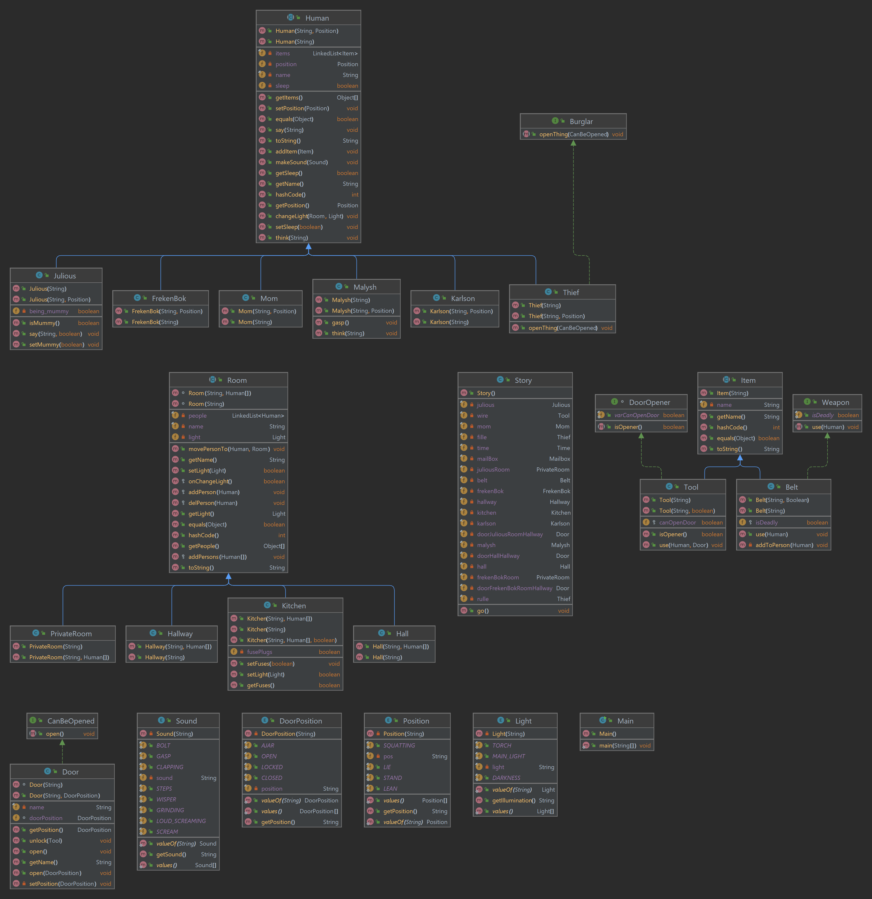

## Лабораторная работа ИТМО программирование 3
### Сиразетдинов Азат P3116

Вариант:9865.6

Текст: Подумать только, что с помощью простой проволочки можно так легко сдвинуть "собачку"! Потом дверь осторожно приоткрыли, и кто-то проскользнул в нее, кто-то был здесь, в тамбуре! У Малыша перехватило дыхание -- это и в самом деле было невероятно. Послышались шепот и тихие шаги... И вдруг раздался грохот -- о, что за грохот! -- и два приглушенных вскрика. И только тогда Карлсон под столом зажег свой фонарик и тут же его снова потушил, но на краткий миг луч света упал на наводящую ужас, устрашающую, смертоносную мумию, которая стояла, прислоненная к стене, и в зловещей улыбке скалила зубы -- зубы дяди Юлиуса. И снова крики, на этот раз более громкие. Все дальнейшее произошло как-то одновременно, и Малыш не смог ни в чем разобраться. Он слышал, как распахнулись двери, -- это выскочили из своих комнат дядя Юлиус и фрекен Бок, и тут же он услышал чьи-то шаги в тамбуре. Карлсон потянул Мамочку к себе за поводок, который он надел ей на шею, и она с глухим стуком упала на пол. Потом он услышал, как фрекен Бок несколько раз повернула выключатель, чтобы зажечь свет в прихожей, но он не зажигался, потому что Карлсон выкрутил все пробки на предохранительном щитке на кухне. "Проказничать лучше в темноте", -- сказал он. И вот фрекен Бок и дядя Юлиус беспомощно стояли, не зная, как осветить прихожую.
