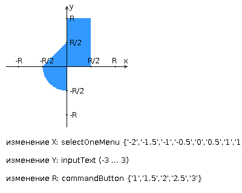

## Лабораторная работа 3 по Веб-программированию
### Вариант 27199

### Deployment
В лабораторной работе сконфигурирован плагин wildfly-maven-plugin и настроен auto-deploy
Для работы надо сконфигурировать путь в jboss-home в pom.xml
* Старт сервера: `mvn wildfly:start`
* Обновление .war: `mvn wildfly:redeploy`
* Выключение сервера: `mvn wiildfly:shutdown`

### Разработать приложение на базе JavaServer Faces Framework, которое осуществляет проверку попадания точки в заданную область на координатной плоскости.

Приложение должно включать в себя 2 facelets-шаблона - стартовую страницу и основную страницу приложения, а также набор управляемых бинов (managed beans), реализующих логику на стороне сервера.

### Стартовая страница должна содержать следующие элементы:

* "Шапку", содержащую ФИО студента, номер группы и номер варианта.
* Интерактивные часы, показывающие текущие дату и время, обновляющиеся раз в 10 секунд.
* Ссылку, позволяющую перейти на основную страницу приложения. 

### Основная страница приложения должна содержать следующие элементы:

* Набор компонентов для задания координат точки и радиуса области в соответствии с вариантом задания. Может потребоваться использование дополнительных библиотек компонентов - ICEfaces (префикс "ace") и PrimeFaces (префикс "p"). Если компонент допускает ввод заведомо некорректных данных (таких, например, как буквы в координатах точки или отрицательный радиус), то приложение должно осуществлять их валидацию.
* Динамически обновляемую картинку, изображающую область на координатной плоскости в соответствии с номером варианта и точки, координаты которых были заданы пользователем. Клик по картинке должен инициировать сценарий, осуществляющий определение координат новой точки и отправку их на сервер для проверки её попадания в область. Цвет точек должен зависить от факта попадания / непопадания в область. Смена радиуса также должна инициировать перерисовку картинки.
* Таблицу со списком результатов предыдущих проверок.
* Ссылку, позволяющую вернуться на стартовую страницу.

### Дополнительные требования к приложению:

* Все результаты проверки должны сохраняться в базе данных под управлением СУБД Oracle.
* Для доступа к БД необходимо использовать протокол JDBC без каких-либо дополнительных библиотек.
* Для управления списком результатов должен использоваться Application-scoped Managed Bean.
* Конфигурация управляемых бинов должна быть задана с помощью параметров в конфигурационном файле.
* Правила навигации между страницами приложения должны быть заданы в отдельном конфигурационном файле

