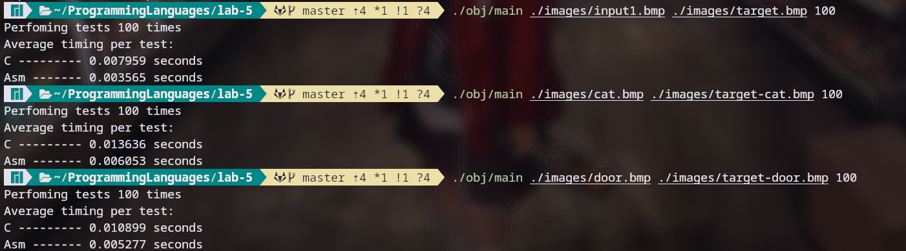

# Assignment: Sepia Filter in C and Assembly
---
Лабораторная работа: Сепия фильтр 
Выполнил: Сиразетдинов Азат P3216

# Задание

В данном задании вам надо реализовать фильтр сепия на языке C и на языке ассемблера. 
- Реализация на языке ассемблера должна использовать векторные инструкции процессора SSE, за счет чего должно быть получено ускорение по сравнению с реализацией на C. 
- Задание считается сданным только в случае ускорения работы фильтра.
- Необходимо написать тест, который будет сравнивать время работы двух реализаций.
- Для работы с изображениями следует использовать библиотеку работы с BMP файлами, которую вы реализовали в третьей лаботаторной работе.

# Результаты тестов:

